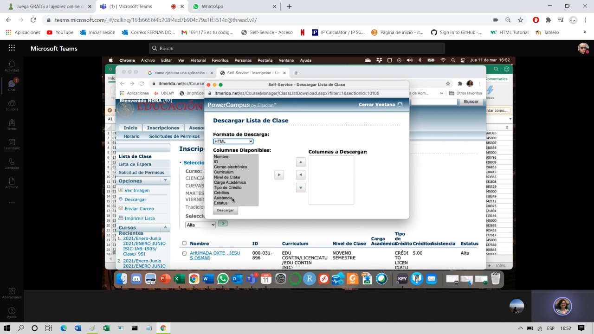

# Modulo de cruces de csv's

## Especificaciones 

1. solo se usaran archivos con extension csv
2. tendra una ventana de modulo

   ### especificaciones

   * En la ventana se cargaran archivos csv (tendra un campo para arrastrar o un boton para cargar tal archivo)
   * aparecera un listado con los headers del archivo cargado 
   * se podra arrastrar los headers a un nuevo campo para formar un archivo csv
   * los archivos tienen todos los atributos deseados y con este se formara el nuevo archiivo
   * tendra un boton de descarga para el archivo creado con los atributos arrastrados del csv
   * el numero campos o atributos no son limitados 

### Campos importantes (atributos o headers)

#### Campos importantes (previsualizacion)

* CURP
* Nombres
* Matricula
* RFC
* SEXO
* appelido paterno
* apellido materno
* telefono 
* promedio ultimo semetre

#### Campos no tan importantes pero si necesarios

* Numero de ingreso
* mail
* etc

#### Imagen tentativa del modulo

#### imagen ejemplo de los campos 

