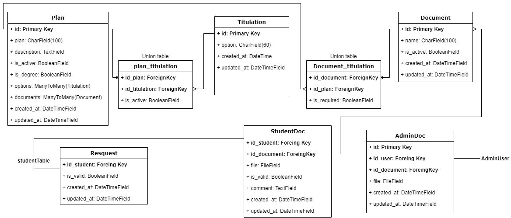

# Módulo de Titulación

API para el proceso de titulación en el area de servicios escolares del ITM

## Descripción

- La titulación se define por planes, dependiendo de la clave que contenga el año en el que te graduaste te correspondrá un plan.

- Los planes tienen diferentes opciones de titulación.

- Los planes de titulación contienen diferentes documentos.

- Un alumno puede solicitar su titulación correspondiente a su plan.

- Un alumno debe enviar los correspondientes documentos y esperar revisión.

- Como respuesta a la revisión recibirá documentos N veces por parte del administrador.

## Diccionario de datos

### Endpoints EXAMPLES

- **GET** /api/plans/ Listado planes registrados en la base de datos.
  - Retornar todos los campos correspondiente a los planes.
  - Todos los campos deben poder filtrarse.
  - Todos los campos deben poder ordenarse.
  - Orden por defecto por fecha de creación (`created_at`).

- **GET** /api/op-titulations/ Listado de opciones de titulación registradas en la base de datos.
  - Retornar todos los campos correspondiente a las opciones de titulación.
  - Todos los campos deben poder filtrarse.
  - Todos los campos deben poder ordenarse.
  - Orden por defecto por fecha de creación (`created_at`).

- **GET** /api/activeoptions/ Listado opciones ligadas a un plan.
  - esta url es la tabla que enlaza las opciones de titulación con los planes titulación.
  - Retornar todos los campos correspondiente a las opciones activas.

# En construccion
